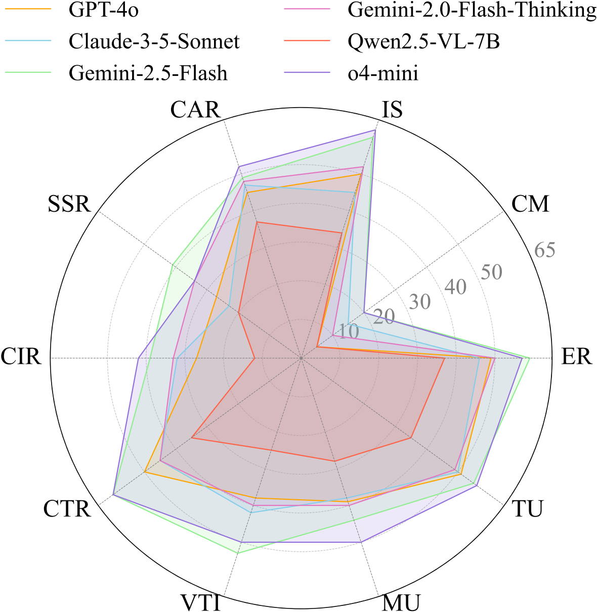
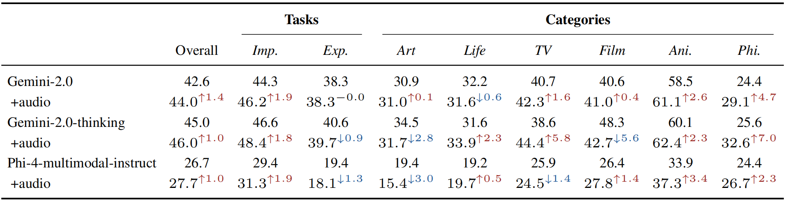

#   MMR-V: *What's Left Unsaid?* A Benchmark for Multimodal Deep Reasoning in Videos


<p align="center">
  <a href="https://huggingface.co/datasets/JokerJan/MMR-VBench"> 🤗 Benchmark</a></a> |
  <a href="https://github.com/GaryStack/MMR-V"> 💻 Code</a> |
  <a href="https://mmr-v.github.io/"> 🏠 Homepage</a>
</p>


🧠 **With MMR-V, we aim to explore whether MLLMs can "think with videos" and mine evidence from long-span, multi-frame video information.**


## 👀 MMR-V Overview
The sequential structure of videos poses a challenge to the ability of multimodal large language models (MLLMs) to 🕵️locate multi-frame evidence and conduct multimodal reasoning. However, existing video benchmarks mainly focus on understanding tasks, which only require models to match frames mentioned in the question (hereafter referred to as ``question frame'') and perceive a few adjacent frames. To address this gap, we propose **MMR-V: A Benchmark for Multimodal Deep Reasoning in Videos**, which is characterized by the following features. 

* *Long-range, multi-frame reasoning*: Models are required to infer and analyze evidence frames that may be far from the question frame. 

* *Beyond perception*: Questions cannot be answered through direct perception alone but require reasoning over hidden information. 

* *Reliability*: All tasks are manually annotated, referencing extensive real-world user understanding to align with common perceptions. 

* *Confusability*: Carefully designed distractor annotation strategies to reduce model shortcuts. 

MMR-V consists of **317** videos and **1,257** tasks. Models like o3 and o4-mini have achieved impressive results on image reasoning tasks by leveraging tool use to enable 🕵️evidence mining on images. Similarly, tasks in MMR-V require models to perform in-depth reasoning and analysis over visual information from different frames of a video, challenging their ability to 🕵️**mine evidence across long-range multi-frame**.

## 🎬 MMR-V Task Examples

<p align="center">
    
</p>

## 🚀 Quick Start

1. Load the MMR-V Benchmark

```shell
huggingface-cli download JokerJan/MMR-VBench --repo-type dataset --local-dir MMR-V --local-dir-use-symlinks False
```
2. Extract videos from the `.tar` files:

```shell
cat videos.tar.part.* > videos.tar
tar -xvf videos.tar
```

3. Evaluation Settings:
   
Please place the unzipped video file under `MMR-V/videos`.

Other model inference details and implementation can be found in `utils
/video_utils.py`.

5. Evaluation with script:

```shell
python evaluation/server_evaluation_on_MMR.py \
      --model_name gemini-2.5-flash-preview-04-17 \
      --api_url https://XXX/v1/chat/completions \
      --api_key sk-XXX \
      --with_cot \
      --frame_count 32
```
Please provide valid API information at the `--api_url` and `--api_key` fields. For open-source models running on a local `vllm` server, set `--api_url` to the local server address and leave `--api_key` empty. If the `--with_cot` flag is specified, the evaluation will use *Chain-of-Thought (CoT) prompting*; otherwise, the model will default to *directly* outputting the final answer.

---
## 📊 Leaderboard <a name="leaderboard"></a>
| Rank | Model | Overall | Implicit | Explicit | Art | Life | TV | Film | Film | Phi. |
|---|---|---|---|---|---|---|---|---|---|---|
| 🥇 |  Human | 86.0 | 80.6 | 91.2 | 57.7 | 92.3 | 90.6 | 92.3 | 90.7 | 70.0 |
| 🥈 | o4-mini | 52.5 | 54.6 | 46.0 | 40.1 | 54.0 | 54.0 | 51.7 | 65.3 | 27.9 |
| 🥉 | Gemini-2.5-Flash | 51.2 | 52.9 |  46.9 |  45.3 | 39.5 | 50.3 | 47.9 | 65.6 | 34.9 |

*Full leaderboard in [our homepage](https://mmr-v.github.io/).*

*📢 The leaderboard is constantly updating as we are welcoming new submissions!*

---


## 🎯 Experiment Results

### Performance across Different Tasks

<p align="center">
    
</p>

### Impact of Audio Input

<p align="center">
    
</p>


### Error Analysis


<p align="center">
    
</p>

## 🧠 Model Response Examples

The figure below presents example responses with Multimodal Chain-of-Thought (MCoT) from two reasoning models to a sample task from MMR-V. (Gemini's response omits part of the option analysis.) In the visualization, *yellow tokens represent reasoning and analysis based on textual information (e.g., the question and answer options), while green tokens indicate the model’s analysis of visual content from the video (including the question frame and evidence frames)*. It can be observed that **o4-mini** engages in deeper reasoning and analysis of the **video content**, ultimately arriving at the correct answer. In contrast, Gemini exhibits a more text-dominated reasoning strategy. This example highlights how MMR-V places greater emphasis on a model’s ability to incorporate visual information into the reasoning process and to mine multimodal cues effectively. 
<p align="center">
    
</p>
The full video corresponding to this example can be found here: https://www.youtube.com/watch?v=g1NuAfkQ-Hw.
