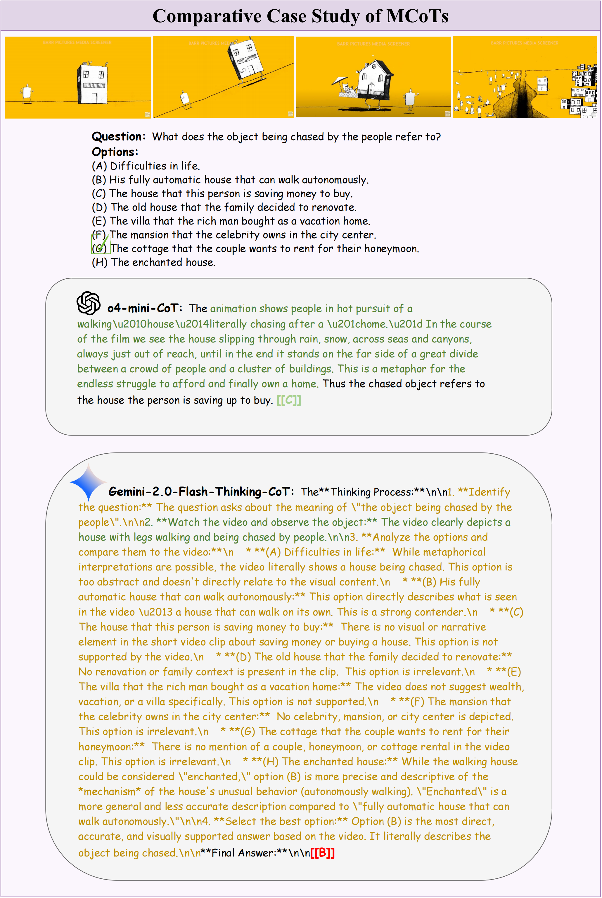

#   MMR-V: *What's Left Unsaid?* A Benchmark for Multimodal Deep Reasoning in Videos


<p align="center">
  <a href="https://huggingface.co/datasets/JokerJan/MMR-VBench"> 🤗 Benchmark</a></a> |
  <a href="https://github.com/GaryStack/MMR-V"> 🏠 Homepage (Coming Soon!)</a>
</p>


This is the code repository of the video reasoning benchmark MMR-V


## 👀 MMR-V Overview
🕵️

## 🎬 MMR-V Task Examples

<p align="center">
    
</p>

## 📚 Evaluation

1. Load the MMR-V Benchmark

```shell
huggingface-cli download JokerJan/MMR-VBench --repo-type dataset --local-dir MMR-V --local-dir-use-symlinks False
```
2. Extract videos from the `.tar` files:

```shell
cat videos.tar.part.* > videos.tar
tar -xvf videos.tar
```

3. Evaluation Settings:

4. Evaluation with script:


## 🧠 Model Response Examples

The figure below presents example responses with Multimodal Chain-of-Thought (MCoT) from two reasoning models to a sample task from MMR-V. (Gemini's response omits part of the option analysis.) In the visualization, *yellow tokens represent reasoning and analysis based on textual information (e.g., the question and answer options), while green tokens indicate the model’s analysis of visual content from the video (including the question frame and evidence frames)*. It can be observed that **o4-mini** engages in deeper reasoning and analysis of the **video content**, ultimately arriving at the correct answer. In contrast, Gemini exhibits a more text-dominated reasoning strategy. This example highlights how MMR-V places greater emphasis on a model’s ability to incorporate visual information into the reasoning process and to mine multimodal cues effectively. 
<p align="center">
    
</p>
The full video corresponding to this example can be found here: https://www.youtube.com/watch?v=g1NuAfkQ-Hw.
